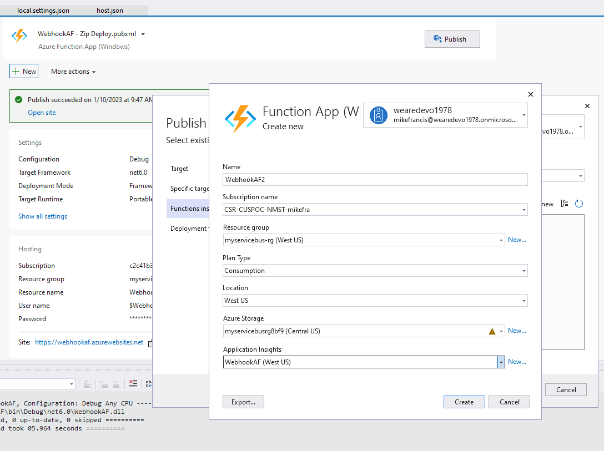
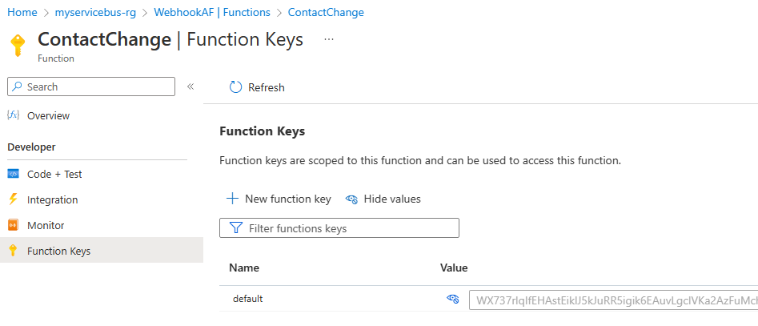
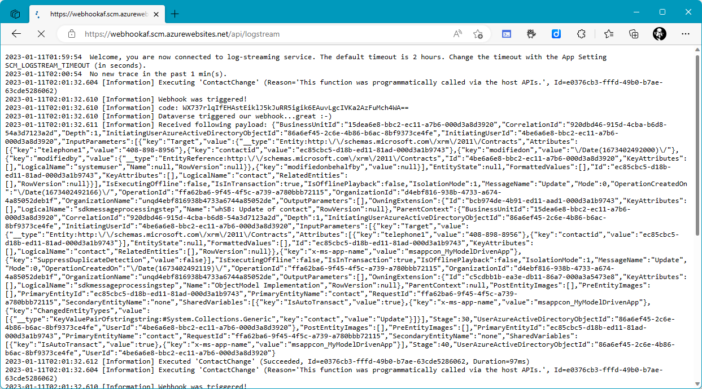
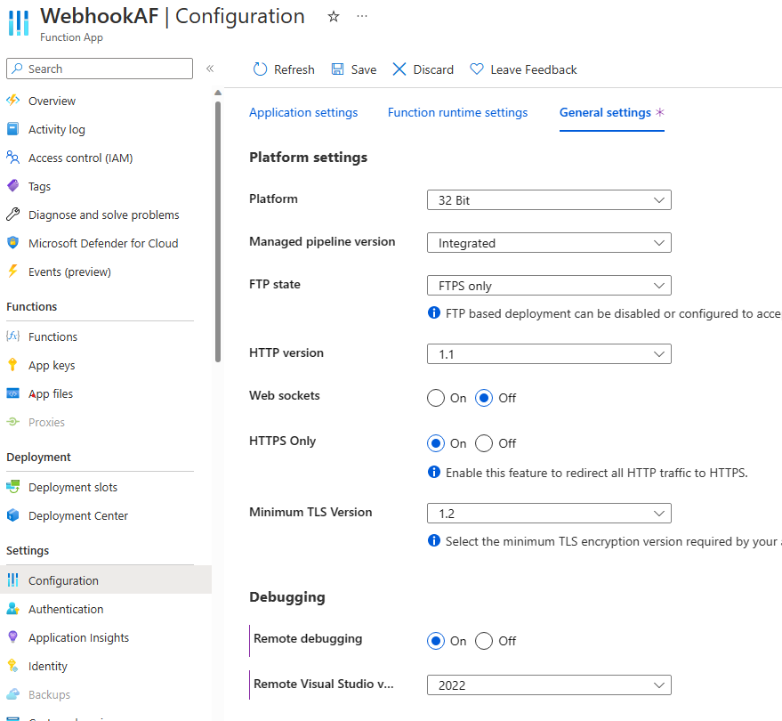
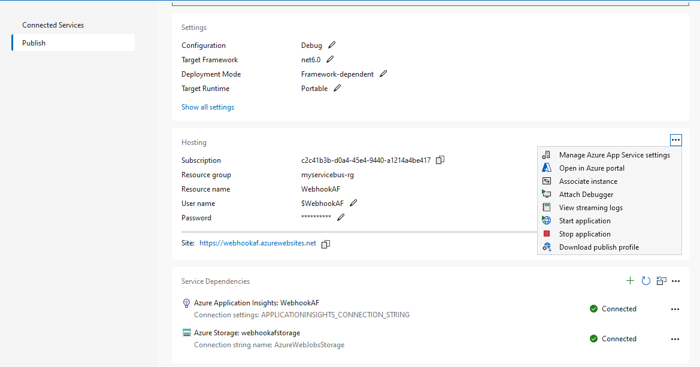

# Lab: Call an Azure function via a webhook triggered by Dataverse

In this lab you will: 
* Create a model driven app that contains the Contact table
* Create an Azure Function that will server as a webhook
* Register the webhook with Dataverse using the ```Plugin Registration Tool```
* Run and debug the Azure Function locally
* Publish the Azure Function to Azure
* Observe Logstream output from the running Azure Function
* Debug the Azure Function remotely from Visual Studio

## Prerequisites

1.	Create an Azure Trial Subscription
Go to https://azure.microsoft.com/en-us/free/ and sign up for a Free Azure Subscription 

2. Create a Microsoft 365 Developer program sandbox (Free)
https://developer.microsoft.com/en-us/microsoft-365/dev-program

3. Install Microsoft Power Platform CLI
https://learn.microsoft.com/en-us/power-platform/developer/cli/introduction

    Download from here:
https://aka.ms/PowerAppsCLI

5. Install Visual Studio 2022.
   https://visualstudio.com
  
6. Install the Azure Development workload in Visual Studio 2022. https://learn.microsoft.com/en-us/dotnet/azure/configure-visual-studio
   
7. Download and install ngrok. https://ngrok.com/download

## Setup: Create Model Driven App 
1. Go to https://make.powerapps.com
2. Create a simple model driven app with the **Contact** table.
3. Run the app and verify you can add and change a contact.

## Build the Webhook - Function App

1. Clone project https://github.com/mjfusa/WebhookAF
2. Open solution **WebhookAF** in Visual Studio

## Run locally, trigger with browser (get)
1. Press F5 to Start the Azure function running locally.
2. Place a breakpoint after the Run function in the code
2. Note the localhost URL:  http://localhost:7066/api/ContactChange
3. Open the URL in a browser and verify the breakpoint is hit.

## Run locally, trigger with Dataverse 
>Note: To trigger from Dataverse we'll need to use ngrok to get a internet IP address to tunnel to the locally running app.

**ngrok http 7066 --host-header localhost**

>Note: **\<random name>.ngrok.io** returned from ngrok. You will need this in the next steps.

Keep ngrok running.

Register the **Webhook endpoint** with the ```Plugin Registration tool```: **http://\<random name>.ngrok.io/api/ContactChange**

Update a contact in your Model Driver App to trigger the webhook in the locally running Azure function.

Verify that a breakpoint can be hit.

## Deploy to Azure. Trigger with Dataverse 

1. In Visual Studio, right click the project and select **Publish**.
2. Login to your Azure tenant when prompted and specify the needed information.
   
3. Publish **Debug** profile app to Azure
4. Get the Azure Function endpoint and function key from Azure Portal
   

5. Update the ```Plugin Registration tool``` registration with Azure Function endpoint and function key. 
> **!Note:** To call a protected Azure function you need to either provide the key as a query string parameter (in the form code=<FUNCTION_KEY>) or you can provide it as a **x-functions-key** header.

7. Start logstream: https://\<your function name>.scm.azurewebsites.net/api/logstream
   E.g. https://webhookaf.scm.azurewebsites.net/api/logstream
6. Update a contact in your Model Driven App to trigger the webhook Azure function running now in Azure.

>Observe Logstream output. Note Trace logs ```[Information]``` in output.


## Configure Remote Debugging in the Azure Function settings

1. Open the Azure Function in Azure and select **Overview**
2. Select **Configuration** | **General Settings**
3. In the **Debugging** section, confirm that 'Remote Debugging' is **On** and **Visual Studio version** is set to your version of Visual Studio.


## Debug the Azure Function with Visual Studio

1. In Visual Studio return to the Publish page and select the three elipsis next to the right of ```Hosting```.
2. Select **Attach Debugger**

3. Set a break point in your code.
4. Update a contact in your Model Driven App to trigger the webhook.
5. Verify that a breakpoint can be hit.
